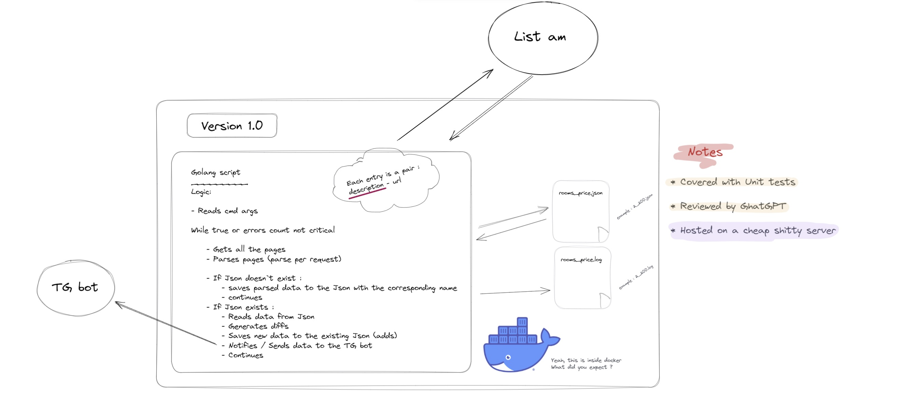

# list.am-new-adds-scanner

## Wtf is this?

🏘️ This is a script that goes to the Armenian`s main advertisement website **list.am** and scratches adds from there, saves them locally, sends you a notification via tg, when new data is added, so you will be a first person to see them. This thing should help you to find a place to live in Yerevan. Hardcoded for now, but will be more flexible someday

🐶 This is a pet project. No expectations. This means that it`s a place for a shitty badly tested code to work. Not optimal decision are done here. However, I will be happy for code review and suggestions ;)

---

## How the hell does it work ?
### Basic info
🫵 You can run it **locally** or via **docker**
> To run locally install golang compiler and dependencies (you can see the commands in Dockerfile)

There are two scripts to use : `run.sh` and `run_docker.sh` :

- `run.sh` - is a controller for the application
- `run_docker.sh` - alias to the main docker commands to build and run docker. When inside - still use `run.sh`
> Just see the sources or try to run them. By default you will be redirected to the helper prompt

> **[!Important]**
>  duplicate `bot_config.example.json`  and name it `bot_config.json` . Put your bot token data there

### Example
`./run.sh` - gives you help prompt
`./run.sh default` - starts scratching website, looking for the new adds up to 200.000 dramms

---

## Current release info : **V1.0**

 😎 I decided to have a some sort of a documentation shown in pictures. Each version will have a corresponding pic *(for example v1.0.jpg)*. So if you are interested in the history of a project - just compare the pictures of the different versions in the [doc](doc)  folder 

